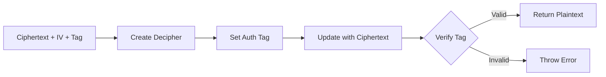

## Overview

Azen encrypts all memory content at rest using **AES-256-GCM** (Advanced Encryption Standard with Galois/Counter Mode). This ensures that stored memories are cryptographically secure and tamper-proof.

## Why AES-256-GCM?

GCM (Galois/Counter Mode) provides:

- **Confidentiality**: 256-bit AES encryption
- **Authenticity**: Built-in authentication tag prevents tampering
- **Performance**: Hardware-accelerated on modern CPUs
- **Security**: Authenticated encryption with associated data (AEAD)

<Info>
AES-256-GCM is approved by NIST and widely used in secure protocols like TLS 1.3.
</Info>

## Implementation

The encryption module is implemented in `apps/api/src/lib/encrypt.ts` using Node.js crypto primitives.

### Master Key Configuration

The system uses a single master key for all encryption operations:

```typescript
import { AZEN_MASTER_KEY } from "../config";

const ALGO = "aes-256-gcm";
const KEY = Buffer.from(AZEN_MASTER_KEY!, "hex");
```

<Warning>
**Critical Security Requirement**: The `AZEN_MASTER_KEY` must be:
- 64 hexadecimal characters (32 bytes)
- Generated with a cryptographically secure random number generator
- Stored securely (environment variable, secrets manager)
- Never committed to version control
- Rotated periodically
</Warning>

### Generating a Master Key

To generate a secure master key:

```bash
node -e "console.log(require('crypto').randomBytes(32).toString('hex'))"
```

This produces output like:
```
8f7d3c9b2a1e6f4d8c7b5a9e3f1d0c2b4a8e6d3c9f7b5a1e3d0c8b6a4e2f1d9c
```

## Encryption Process

The `encryptText` function (`apps/api/src/lib/encrypt.ts:12-28`) encrypts plaintext and returns three components:

```typescript
export function encryptText(plainText: string) {
  const iv = randomBytes(12);
  const cipher = createCipheriv(ALGO, KEY, iv);

  const encrypted = Buffer.concat([
    cipher.update(plainText, "utf8"),
    cipher.final(),
  ]);

  const tag = cipher.getAuthTag();

  return {
    ciphertext: encrypted.toString("base64"),
    iv: iv.toString("base64"),
    tag: tag.toString("base64"),
  };
}
```

### Encryption Components

| Component | Purpose | Size | Encoding |
|-----------|---------|------|----------|
| **Ciphertext** | Encrypted data | Variable | Base64 |
| **IV** (Initialization Vector) | Ensures uniqueness | 12 bytes | Base64 |
| **Tag** | Authentication tag | 16 bytes | Base64 |

### Why 12-byte IV?

GCM mode requires a 96-bit (12-byte) IV for optimal security:
- Standard recommended size for AES-GCM
- Must be unique for each encryption with the same key
- Randomly generated using `crypto.randomBytes(12)`

<Note>
Each memory gets a unique IV, even if the plaintext content is identical. This prevents pattern analysis attacks.
</Note>

### Authentication Tag

The 16-byte authentication tag is computed over the ciphertext and provides:
- **Integrity**: Detects any modification to the ciphertext
- **Authenticity**: Proves the data was encrypted with the correct key

Attempting to decrypt tampered ciphertext will fail with an error.

## Decryption Process

The `decryptText` function (`apps/api/src/lib/encrypt.ts:30-49`) reverses the encryption:

```typescript
export function decryptText(
  ciphertext: string,
  iv: string,
  tag: string,
) {
  const decipher = createDecipheriv(
    ALGO,
    KEY,
    Buffer.from(iv, "base64")
  );

  decipher.setAuthTag(Buffer.from(tag, "base64"));

  const decrypted = Buffer.concat([
    decipher.update(Buffer.from(ciphertext, "base64")),
    decipher.final(),
  ]);

  return decrypted.toString("utf8");
}
```

### Decryption Flow



### Error Handling

Decryption can fail if:
- The authentication tag is invalid (data was tampered)
- The IV is incorrect
- The master key is wrong
- The ciphertext is corrupted

Any of these conditions will throw an error from `decipher.final()`.

## Storage in Database

Encrypted memories are stored in the `Memory` table with three fields (`packages/db/src/db/schema.ts:239-241`):

```typescript
export const memory = pgTable("Memory", {
  // ... other fields
  encryptedContent: text("encrypted_content").notNull(),
  iv: text("iv").notNull(),
  tag: text("tag").notNull(),
  // ...
});
```

All three components must be stored together to enable decryption.

### Example Database Record

```json
{
  "id": "550e8400-e29b-41d4-a716-446655440000",
  "encryptedContent": "7xJtKp2sE9vQ3wZ8hN5bC1fG6kL4mP0dR9uY8tA2sX7vB5nM3jH6pW1qD4rT8c=",
  "iv": "a3b8c9d2e1f0g4h5i6j7k8l9",
  "tag": "m1n2o3p4q5r6s7t8u9v0w1x2y3z4",
  "userId": "...",
  "organizationId": "...",
  "createdAt": "2026-03-05T10:30:00Z",
  "embedded": true
}
```

## Usage in API Endpoints

### Memory Creation

From `apps/api/src/routes/memory.ts:41`:

```typescript
const { text } = parsed.data;
const memId = randomUUID();
const { ciphertext, iv, tag } = encryptText(text);

const [rec] = await db
  .insert(memory)
  .values({
    id: memId,
    userId,
    organizationId,
    encryptedContent: ciphertext,
    iv,
    tag,
  }).returning();
```

### Memory Retrieval

From `apps/api/src/routes/memory.ts:134`:

```typescript
const memories = items.map((m) => ({
  id: m.id,
  content: decryptText(m.encryptedContent, m.iv, m.tag),
  metadata: m.metadata,
  createdAt: m.createdAt,
  embedded: m.embedded,
}));
```

### Search Results

From `apps/api/src/routes/search.ts:80`:

```typescript
return {
  id: m.id,
  content: decryptText(m.encryptedContent, m.iv, m.tag),
  metadata: m.metadata,
  createdAt: m.createdAt,
  embedded: m.embedded,
};
```

<Note>
Decryption happens at query time. The plaintext never leaves the API server's memory.
</Note>

## Security Considerations

### What is Encrypted?

**Encrypted**:
- Memory content (plaintext stored in `Memory` table)
- Stored at rest in PostgreSQL

**Not Encrypted**:
- Memory IDs (UUIDs)
- User IDs and organization IDs (needed for queries)
- Timestamps and metadata
- Vector embeddings (stored in Pinecone)

<Warning>
Vector embeddings are **not encrypted** because similarity search requires mathematical operations on the raw vectors. Embeddings are semantic representations and don't directly reveal the original text, but they can be used to infer meaning.
</Warning>

### Threat Model

**Protection Against**:
- Database breach (ciphertext is useless without master key)
- Unauthorized database access (read-only access reveals no plaintext)
- Storage media theft (encrypted at rest)

**Does Not Protect Against**:
- Compromise of the master key
- Memory dumps from the API server process
- Attacks on the embedding vectors
- Side-channel attacks during decryption

### Key Rotation Strategy

To rotate the master key:

1. Generate a new master key
2. Deploy code that can decrypt with old key, encrypt with new key
3. Background job to re-encrypt all memories:
   - Decrypt with old key
   - Encrypt with new key
   - Update database record
4. Remove old key after all data is re-encrypted

<Info>
Key rotation is not currently implemented but can be added using a `keyVersion` field in the `Memory` table.
</Info>

## Performance Impact

### Encryption Overhead

- **Encryption**: ~0.1-0.5ms per memory (depends on text size)
- **Decryption**: ~0.1-0.5ms per memory
- **Hardware Acceleration**: Modern CPUs have AES-NI instructions

### At Scale

- Encrypting 1000 memories: ~100-500ms
- Decrypting 1000 memories: ~100-500ms
- Negligible compared to network and database I/O

## Compliance and Standards

AES-256-GCM meets requirements for:

- **NIST**: Approved for use in Federal Information Processing Standards (FIPS)
- **GDPR**: Provides "encryption at rest" for personal data
- **HIPAA**: Satisfies "encryption of data at rest" requirements
- **SOC 2**: Demonstrates data protection controls

<Note>
Azen's encryption implementation uses standard Node.js crypto module, which is based on OpenSSL and FIPS-validated.
</Note>

## Related Concepts

- [Memory System](/concepts/memory-system) - How encryption fits into the memory lifecycle
- [Semantic Search](/concepts/semantic-search) - Why embeddings are not encrypted
- [Organizations](/concepts/organizations) - How encryption works with multi-tenancy
