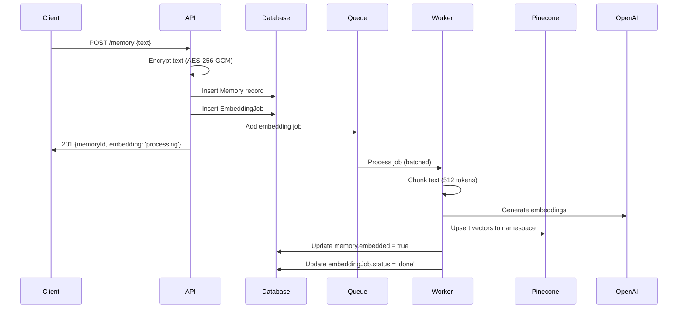

## Overview

Azen's memory system is built on a three-layer architecture that combines relational database storage, asynchronous embedding processing, and vector search capabilities. Every memory goes through a complete lifecycle from creation to searchability.

## Memory Lifecycle



## Database Schema

The memory system uses two core tables in PostgreSQL:

### Memory Table

Defined in `packages/db/src/db/schema.ts:230-245`:

```typescript
export const memory = pgTable("Memory", {
  id: text("id").primaryKey(),
  userId: text("user_id").notNull()
    .references(() => user.id, { onDelete: "cascade" }),
  organizationId: text("organization_id")
    .references(() => organization.id, { onDelete: "cascade" }),
  encryptedContent: text("encrypted_content").notNull(),
  iv: text("iv").notNull(),
  tag: text("tag").notNull(),
  metadata: json("metadata"),
  createdAt: timestamp("created_at").defaultNow().notNull(),
  embedded: boolean("embedded").default(false),
});
```

<Note>
The `embedded` boolean flag tracks whether vector embeddings have been successfully created and indexed for this memory.
</Note>

### EmbeddingJob Table

Defined in `packages/db/src/db/schema.ts:252-271`:

```typescript
export const embeddingJob = pgTable("EmbeddingJob", {
  id: text("id").primaryKey(),
  memoryId: text("memory_id").notNull()
    .references(() => memory.id, { onDelete: "cascade" }),
  userId: text("user_id").notNull()
    .references(() => user.id, { onDelete: "cascade" }),
  organizationId: text("organization_id")
    .references(() => organization.id, { onDelete: "cascade" }),
  status: text("status").default("pending"),
  attempts: integer("attempts").default(0),
  lastError: text("last_error"),
  availableAt: timestamp("available_at"),
  createdAt: timestamp("created_at").defaultNow().notNull(),
  updatedAt: timestamp("updated_at").$onUpdate(() => new Date()).notNull(),
});
```

## Memory Creation Flow

When a client creates a memory via `POST /memory`, the following steps occur (`apps/api/src/routes/memory.ts:20-92`):

### 1. Encryption

The plain text is immediately encrypted before storage:

```typescript
const memId = randomUUID();
const { ciphertext, iv, tag } = encryptText(text);
```

See [Encryption](/concepts/encryption) for details on the AES-256-GCM implementation.

### 2. Database Insert

Both the memory record and embedding job are created atomically:

```typescript
const [rec] = await db
  .insert(memory)
  .values({
    id: memId,
    userId,
    organizationId,
    encryptedContent: ciphertext,
    iv,
    tag,
  }).returning();

const jobId = randomUUID();
const [jobRec] = await db
  .insert(embeddingJob)
  .values({
    id: jobId,
    memoryId: rec.id,
    userId,
    organizationId,
    status: "queued",
  }).returning();
```

### 3. Queue Job

The embedding job is added to a BullMQ queue with retry logic:

```typescript
await embeddingsQueue.add('embed', {
  jobId: jobRec.id,
  memoryId: rec.id,
  text: text,
  organizationId,
  userId,
}, {
  attempts: Number(process.env.DLQ_ATTEMPTS ?? 5),
  backoff: { type: 'exponential', delay: 2000 },
  removeOnComplete: 1000,
  removeOnFail: 1000,
});
```

<Info>
The original plaintext is passed to the queue for embedding. Vector embeddings are computed on unencrypted text.
</Info>

## Asynchronous Embedding Processing

Embedding jobs are processed by workers with batching optimization (`apps/api/src/workers/embeddings-workers.ts`).

### Batching Strategy

Workers buffer jobs and process them in batches to optimize throughput:

```typescript
let localBuffer: BufferedItem[] = [];
let bufferTimer: NodeJS.Timeout | null = null;

const worker = new Worker(QUEUE_NAME, async (job) => {
  return await new Promise<void>((resolve, reject) => {
    localBuffer.push({ job, resolve, reject });
    
    if (localBuffer.length >= Number(BATCH_SIZE)) {
      if (bufferTimer) { clearTimeout(bufferTimer); bufferTimer = null; }
      scheduleFlush();
    } else {
      scheduleFlush();
    }
  });
}, {
  connection: bullRedis,
  concurrency: Number(opts.concurrency ?? WORKER_CONCURRENCY),
  lockDuration: 5 * 60 * 1000,
});
```

Jobs are flushed when:
- The buffer reaches `BATCH_SIZE`
- `BATCH_WAIT_MS` timeout expires

### Embedding Job Processing

The core embedding logic (`apps/api/src/jobs/embed-job.ts:15-41`):

```typescript
export async function processEmbeddingJob(payload: EmbedPayLoad) {
  const { text, memoryId, organizationId, jobId } = payload;
  
  // 1. Chunk text into 512-token segments with 50-token overlap
  const chunks = chunkText(text);
  
  // 2. Generate embeddings for all chunks
  const vectors = await embedBatch(chunks);
  
  // 3. Create vector IDs: memoryId::chunkIndex
  const ids = chunks.map((_, i) => `${memoryId}::${i}`);
  
  // 4. Upsert to organization-specific namespace
  const namespace = `org-${organizationId}`;
  await upsertVectors(ids, vectors, namespace, memoryID);
  
  // 5. Mark memory as embedded
  await db
    .update(memory)
    .set({ embedded: true })
    .where(eq(memory.id, memoryId));
}
```

### Text Chunking

Large texts are split into overlapping chunks (`apps/api/src/lib/chunk.ts:5-13`):

```typescript
export function chunkText(text: string, maxTokens = 512, overlap = 50) {
  const tokens = enc.encode(text);
  const chunks: string[] = [];
  for(let i = 0; i < tokens.length; i += (maxTokens - overlap)) {
    const sliced = tokens.slice(i, i + maxTokens);
    chunks.push(enc.decode(sliced));
  }
  return chunks;
}
```

<Note>
Chunking uses `js-tiktoken` with the GPT-4o encoding model to ensure accurate token counts.
</Note>

**Why overlapping chunks?**
- Prevents semantic information from being split at chunk boundaries
- Default 50-token overlap maintains context between adjacent chunks
- Each chunk can be independently embedded and searched

## Memory Retrieval

### List All Memories

The `GET /memory` endpoint returns paginated memories for an organization (`apps/api/src/routes/memory.ts:94-148`):

```typescript
const items = await db
  .select({
    id: memory.id,
    encryptedContent: memory.encryptedContent,
    iv: memory.iv,
    tag: memory.tag,
    metadata: memory.metadata,
    createdAt: memory.createdAt,
    embedded: memory.embedded,
  })
  .from(memory)
  .where(eq(memory.organizationId, organizationId))
  .orderBy(desc(memory.createdAt))
  .offset(offset)
  .limit(per);

// Decrypt on-the-fly
const memories = items.map((m) => ({
  id: m.id,
  content: decryptText(m.encryptedContent, m.iv, m.tag),
  metadata: m.metadata,
  createdAt: m.createdAt,
  embedded: m.embedded,
}));
```

<Warning>
Decryption happens at query time. Memories are never stored in plaintext.
</Warning>

### Get Single Memory

Retrieval by ID with organization-level isolation (`apps/api/src/routes/memory.ts:150-190`):

```typescript
const [rec] = await db
  .select()
  .from(memory)
  .where(
    and(
      eq(memory.id, memoryId),
      eq(memory.organizationId, organizationId)
    )
  )
  .limit(1);

const content = decryptText(rec.encryptedContent, rec.iv, rec.tag);
```

## Memory Deletion

Deletion requires cleaning up three systems (`apps/api/src/routes/memory.ts:192-253`):

```typescript
// 1. Delete from vector database
const namespace = `org-${rec.organizationId}`;
await deleteMemoryVectors(rec.id, namespace);

// 2. Delete embedding jobs
await db.delete(embeddingJob).where(
  and(
    eq(embeddingJob.memoryId, memoryId),
    eq(embeddingJob.organizationId, organizationId)
  )
);

// 3. Delete memory record
await db.delete(memory).where(
  and(
    eq(memory.id, memoryId),
    eq(memory.organizationId, organizationId)
  )
);
```

<Note>
Vector deletion uses metadata filtering in Pinecone to remove all chunks associated with a memory.
</Note>

## Error Handling and Retry Logic

Embedding jobs have built-in resilience:

### Retry Configuration

- **Max Attempts**: 5 (configurable via `DLQ_ATTEMPTS`)
- **Backoff**: Exponential with 2000ms initial delay
- **Lock Duration**: 5 minutes per job

### Failure Handling

When a job exhausts all retries (`apps/api/src/workers/embeddings-workers.ts:99-116`):

```typescript
worker.on('failed', async (job, err) => {
  const attemptsMade = job?.attemptsMade ?? 0;
  const threshold = Number(DLQ_ATTEMPTS ?? DLQ_ATTEMPTS);
  
  if (job?.data?.jobId && attemptsMade >= threshold) {
    await db
      .update(embeddingJob)
      .set({
        status: "failed",
        lastError: String(err ?? ""),
      })
      .where(sql`${embeddingJob.id} = ${job.data.jobId}`);
  }
});
```

Failed jobs are marked in the database but the memory record remains, allowing manual retry or reprocessing.

## Performance Characteristics

### Write Path

- **Synchronous**: Encryption + DB insert (~10-50ms)
- **Asynchronous**: Embedding generation + vector upsert (~500-2000ms)
- **Client Response**: Immediate after DB insert

### Read Path

- **List**: Paginated query + batch decryption (~50-200ms for 20 items)
- **Get by ID**: Single record query + decryption (~5-20ms)
- **Search**: Vector query + DB fetch + decryption (~100-500ms)

### Scalability

- **Batching**: Workers process multiple embeddings in single OpenAI API call
- **Concurrency**: Configurable worker pool size
- **Organization Isolation**: Vector namespaces prevent cross-tenant queries

## Related Concepts

- [Encryption](/concepts/encryption) - How memory content is encrypted
- [Semantic Search](/concepts/semantic-search) - How memories are found via vector similarity
- [Organizations](/concepts/organizations) - Multi-tenancy and data isolation
