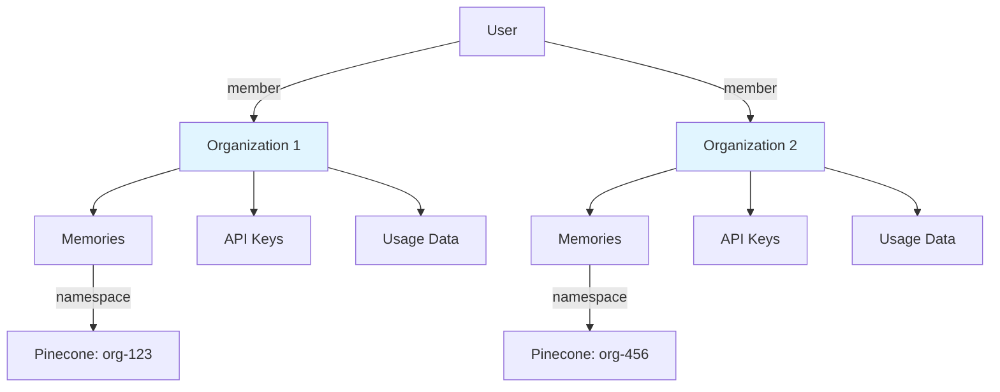

## Overview

Azen uses **organization-based multi-tenancy** to separate data between different teams and companies. Every memory, API key, and resource belongs to an organization.

## Multi-Tenancy Architecture



## Database Schema

### Organization Table

Core organization data (`packages/db/src/db/schema.ts:130-142`):

```typescript
export const organization = pgTable(
  "organization",
  {
    id: text("id").primaryKey(),
    name: text("name").notNull(),
    slug: text("slug").notNull().unique(),
    description: text("description"),
    logo: text("logo"),
    createdAt: timestamp("created_at").notNull(),
    metadata: text("metadata"),
  },
  (table) => [uniqueIndex("organization_slug_uidx").on(table.slug)],
);
```

**Key Fields**:
- `id`: Unique identifier (UUID)
- `slug`: URL-friendly identifier (unique, for routing)
- `name`: Display name
- `metadata`: JSON for extensibility

### Member Table

User-organization relationships (`packages/db/src/db/schema.ts:144-161`):

```typescript
export const member = pgTable(
  "member",
  {
    id: text("id").primaryKey(),
    organizationId: text("organization_id")
      .notNull()
      .references(() => organization.id, { onDelete: "cascade" }),
    userId: text("user_id")
      .notNull()
      .references(() => user.id, { onDelete: "cascade" }),
    role: text("role").default("member").notNull(),
    createdAt: timestamp("created_at").notNull(),
  },
  (table) => [
    index("member_organizationId_idx").on(table.organizationId),
    index("member_userId_idx").on(table.userId),
  ],
);
```

**Roles**:
- `member`: Default role, basic access
- Custom roles can be added (owner, admin, viewer, etc.)

### Invitation Table

Pending organization invitations (`packages/db/src/db/schema.ts:163-183`):

```typescript
export const invitation = pgTable(
  "invitation",
  {
    id: text("id").primaryKey(),
    organizationId: text("organization_id")
      .notNull()
      .references(() => organization.id, { onDelete: "cascade" }),
    email: text("email").notNull(),
    role: text("role"),
    status: text("status").default("pending").notNull(),
    expiresAt: timestamp("expires_at").notNull(),
    createdAt: timestamp("created_at").defaultNow().notNull(),
    inviterId: text("inviter_id")
      .notNull()
      .references(() => user.id, { onDelete: "cascade" }),
  },
  (table) => [
    index("invitation_organizationId_idx").on(table.organizationId),
    index("invitation_email_idx").on(table.email),
  ],
);
```

**Status Values**:
- `pending`: Invitation sent, not yet accepted
- `accepted`: User joined the organization
- `expired`: Invitation past `expiresAt` date
- `revoked`: Manually cancelled

## Organization Relationships

Every major resource includes an `organizationId` foreign key:

### Memory → Organization

```typescript
export const memory = pgTable("Memory", {
  id: text("id").primaryKey(),
  userId: text("user_id").notNull()
    .references(() => user.id, { onDelete: "cascade" }),
  organizationId: text("organization_id")
    .references(() => organization.id, { onDelete: "cascade" }),
  // ...
});
```

From `packages/db/src/db/schema.ts:230-245`.

### API Key → Organization

```typescript
export const apikey = pgTable(
  "apikey",
  {
    id: text("id").primaryKey(),
    userId: text("user_id").notNull()
      .references(() => user.id, { onDelete: "cascade" }),
    organizationId: text("organization_id")
      .references(() => organization.id, { onDelete: "cascade" }),
    // ...
  },
  // ...
);
```

From `packages/db/src/db/schema.ts:92-128`.

**Dual Attribution**:
- `userId`: Creator/owner of the API key
- `organizationId`: Billing and data isolation boundary

### EmbeddingJob → Organization

```typescript
export const embeddingJob = pgTable("EmbeddingJob", {
  id: text("id").primaryKey(),
  memoryId: text("memory_id").notNull()
    .references(() => memory.id, { onDelete: "cascade" }),
  userId: text("user_id").notNull()
    .references(() => user.id, { onDelete: "cascade" }),
  organizationId: text("organization_id")
    .references(() => organization.id, { onDelete: "cascade" }),
  // ...
});
```

From `packages/db/src/db/schema.ts:252-271`.

### Usage Tracking → Organization

```typescript
export const apikeyUsage = pgTable(
  "api_usage",
  {
    id: text("id").primaryKey().notNull(),
    userId: text("user_id").notNull()
      .references(() => user.id, { onDelete: "cascade" }),
    organizationId: text("organization_id")
      .references(() => organization.id, { onDelete: "cascade" }),
    apiKeyId: text("api_key_id").notNull(),
    date: text("date").notNull(),
    routeGroup: text("route_group").notNull(),
    totalRequests: integer("total_requests").notNull().default(0),
    // ...
  },
  // ...
);
```

From `packages/db/src/db/schema.ts:191-223`.

**Unique Index** (`packages/db/src/db/schema.ts:214-220`):
```typescript
usageUnique: uniqueIndex("ux_api_usage_unique").on(
  table.organizationId,
  table.userId,
  table.apiKeyId,
  table.date,
  table.routeGroup
)
```

This ensures accurate aggregation of usage data per organization.

## Session-Based Organization Context

The `session` table tracks which organization a user is currently working in:

```typescript
export const session = pgTable(
  "session",
  {
    id: text("id").primaryKey(),
    expiresAt: timestamp("expires_at").notNull(),
    token: text("token").notNull().unique(),
    userId: text("user_id").notNull()
      .references(() => user.id, { onDelete: "cascade" }),
    activeOrganizationId: text("active_organization_id"),
    // ...
  },
  // ...
);
```

From `packages/db/src/db/schema.ts:27-45`.

<Info>
Users can be members of multiple organizations. The `activeOrganizationId` determines which organization's data they're currently accessing.
</Info>

## Authentication and Authorization

The `authMiddleware` enforces organization context on every API request (`apps/api/src/middlewares/authMiddleware.ts:5-54`).

### Session-Based Auth

```typescript
const session = await auth.api.getSession({ headers: c.req.raw.headers });

if (session && session.user) {
  const userId = session.user.id;
  const organizationId = session.session.activeOrganizationId;

  if (!organizationId) {
    throw new HTTPException(403, { message: "Unauthorized" });
  }

  c.set("userId", userId);
  c.set("organizationId", organizationId);
  return await next();
}
```

**Flow**:
1. Extract session from request headers
2. Get `activeOrganizationId` from session
3. If missing, reject request (user must select an organization)
4. Set context variables for downstream handlers

### API Key Auth

```typescript
const key = c.req.header("azen-api-key") ?? "";
if (!key) throw new HTTPException(401, { message: "no api key" });

const response = await auth.api.verifyApiKey({ body: { key } });

if (!response || !response.valid) {
  throw new HTTPException(403, {
    message: response.error?.message ?? "Invalid API key",
  });
}

const userId = response.key?.userId;
const apiKeyId = response.key?.id;
const organizationId = response.key?.metadata?.organizationId;

if (!organizationId || !userId || !apiKeyId) {
  throw new HTTPException(403, {
    message: "Invalid API key",
  });
}

c.set("userId", userId);
c.set("apiKeyId", apiKeyId);
c.set("organizationId", organizationId);
```

**Flow**:
1. Extract API key from `azen-api-key` header
2. Verify key validity and rate limits
3. Extract `organizationId` from key metadata
4. Set context variables

<Warning>
Every API key must have `organizationId` in metadata. Keys without an organization are rejected.
</Warning>

## Data Isolation

Organization ID is enforced at three layers:

### 1. Database Queries

Every query includes `organizationId` filter. Example from `apps/api/src/routes/memory.ts:94-111`:

```typescript
const items = await db
  .select({
    id: memory.id,
    encryptedContent: memory.encryptedContent,
    iv: memory.iv,
    tag: memory.tag,
    metadata: memory.metadata,
    createdAt: memory.createdAt,
    embedded: memory.embedded,
  })
  .from(memory)
  .where(eq(memory.organizationId, organizationId))
  .orderBy(desc(memory.createdAt))
  .offset(offset)
  .limit(per);
```

### 2. Vector Namespaces

Pinecone namespaces isolate embeddings. From `apps/api/src/jobs/embed-job.ts:25`:

```typescript
const namespace = `org-${organizationId}`;
await upsertVectors(ids, vectors, namespace, memoryID);
```

Each organization's vectors are stored in a separate namespace:
- Organization `org-123` → namespace `org-org-123`
- Organization `org-456` → namespace `org-org-456`

**Vector Search** (`apps/api/src/routes/search.ts:42-43`):
```typescript
const namespace = `org-${organizationId}`;
const matches = await queryVectors(qEmb, topK, namespace);
```

<Note>
Pinecone namespaces provide logical separation. Queries against one namespace cannot access vectors in another.
</Note>

### 3. Cascading Deletes

When an organization is deleted, all related data is automatically removed:

```sql
organization (deleted)
  ↓ CASCADE
  ├─ members (deleted)
  ├─ memories (deleted)
  │   ↓ CASCADE
  │   └─ embeddingJobs (deleted)
  ├─ apikeys (deleted)
  │   ↓ CASCADE
  │   └─ apikeyUsage (deleted)
  └─ invitations (deleted)
```

This is enforced by foreign key constraints with `onDelete: "cascade"` in the schema.

## Organization Lifecycle

### 1. Creation

Organizations are typically created during onboarding:

```typescript
const orgId = randomUUID();
await db.insert(organization).values({
  id: orgId,
  name: "Acme Corp",
  slug: "acme-corp",
  createdAt: new Date(),
});

// Add creator as first member
await db.insert(member).values({
  id: randomUUID(),
  organizationId: orgId,
  userId: creatorUserId,
  role: "owner",
  createdAt: new Date(),
});
```

### 2. Inviting Members

```typescript
const inviteId = randomUUID();
await db.insert(invitation).values({
  id: inviteId,
  organizationId: orgId,
  email: "colleague@example.com",
  role: "member",
  status: "pending",
  expiresAt: new Date(Date.now() + 7 * 24 * 60 * 60 * 1000), // 7 days
  inviterId: currentUserId,
});

// Send invitation email
await sendInvitationEmail(inviteId);
```

### 3. Accepting Invitations

```typescript
const [invite] = await db
  .select()
  .from(invitation)
  .where(
    and(
      eq(invitation.id, inviteId),
      eq(invitation.status, "pending"),
      gt(invitation.expiresAt, new Date())
    )
  );

if (!invite) {
  throw new Error("Invalid or expired invitation");
}

// Create member record
await db.insert(member).values({
  id: randomUUID(),
  organizationId: invite.organizationId,
  userId: currentUserId,
  role: invite.role ?? "member",
  createdAt: new Date(),
});

// Mark invitation as accepted
await db
  .update(invitation)
  .set({ status: "accepted" })
  .where(eq(invitation.id, inviteId));
```

### 4. Switching Organizations

Users can switch between organizations by updating their session:

```typescript
await db
  .update(session)
  .set({ activeOrganizationId: newOrgId })
  .where(eq(session.id, sessionId));
```

Subsequent requests will use the new organization context.

### 5. Deletion

Deleting an organization triggers cascading deletes:

```typescript
// This will cascade to all related records
await db
  .delete(organization)
  .where(eq(organization.id, orgId));

// Separately clean up Pinecone namespace
const namespace = `org-${orgId}`;
await index.namespace(namespace).deleteAll();
```

<Warning>
Organization deletion is permanent and irreversible. All memories, embeddings, and usage data are lost.
</Warning>

## Multi-Tenancy Patterns

Azen uses **shared database, shared schema** multi-tenancy:

### Advantages

- **Cost Efficiency**: Single database instance for all tenants
- **Operational Simplicity**: One schema to maintain
- **Query Performance**: Database-level optimizations apply to all tenants
- **Cross-Tenant Analytics**: Possible (with proper access controls)

### Disadvantages

- **Noisy Neighbor**: One tenant can impact others (mitigated by connection pooling)
- **Data Leakage Risk**: Requires careful query filtering (every query must include `organizationId`)
- **Scaling Limits**: Single database has throughput ceiling (can shard by organization later)

### Alternative: Database-per-Tenant

For very large organizations, you could:
- Create separate database instances
- Route queries based on `organizationId`
- Provide dedicated compute resources

Azen's current architecture supports this via connection string routing.

## Security Considerations

### Query Injection Prevention

Drizzle ORM prevents SQL injection:

```typescript
// SAFE: Parameterized query
await db
  .select()
  .from(memory)
  .where(eq(memory.organizationId, organizationId));

// UNSAFE: String interpolation (Drizzle doesn't allow this)
// await db.execute(`SELECT * FROM memory WHERE organization_id = '${organizationId}'`);
```

### Privilege Escalation Prevention

Users cannot access organizations they're not members of:

```typescript
// Check membership before granting access
const [membership] = await db
  .select()
  .from(member)
  .where(
    and(
      eq(member.userId, userId),
      eq(member.organizationId, requestedOrgId)
    )
  );

if (!membership) {
  throw new HTTPException(403, { message: "Not a member of this organization" });
}
```

### API Key Scoping

API keys are tied to a single organization:

```typescript
const organizationId = response.key?.metadata?.organizationId;

if (!organizationId) {
  throw new HTTPException(403, { message: "API key not associated with an organization" });
}
```

**Best Practice**: Generate separate API keys per organization, even if the same user is a member of multiple organizations.

## Billing and Usage Attribution

Organization ID is the billing boundary:

### Usage Aggregation

```typescript
const usage = await db
  .select({
    totalRequests: sum(apikeyUsage.totalRequests),
    memoryCount: sum(apikeyUsage.memoryCount),
    searchCount: sum(apikeyUsage.searchCount),
  })
  .from(apikeyUsage)
  .where(
    and(
      eq(apikeyUsage.organizationId, orgId),
      gte(apikeyUsage.date, billingPeriodStart),
      lte(apikeyUsage.date, billingPeriodEnd)
    )
  );
```

### Cost Allocation

- **Memory Storage**: Count of `memory` records per organization
- **Vector Storage**: Count of vectors in `org-{id}` namespace
- **Embedding Generation**: Count of `embeddingJob` records with status "done"
- **Search Queries**: Count of search requests via `apikeyUsage.searchCount`

## Related Concepts

- [Memory System](/concepts/memory-system) - How memories are scoped to organizations
- [Encryption](/concepts/encryption) - Security within organization boundaries
- [Semantic Search](/concepts/semantic-search) - How namespaces isolate vector searches
