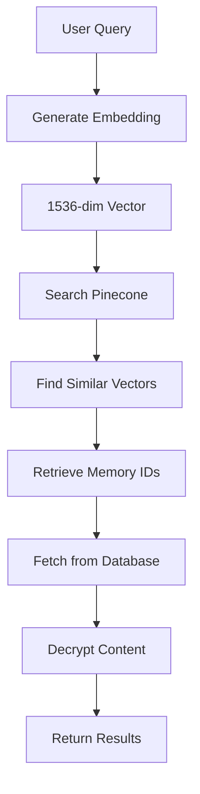

## Overview

Azen uses **semantic search** to find memories based on meaning, not just keyword matching. This is powered by OpenAI embeddings and Pinecone vector database.

## How Semantic Search Works

Traditional keyword search finds exact word matches. Semantic search understands:
- Synonyms ("car" matches "automobile")
- Context ("bank" as financial vs. river)
- Intent ("how to reset password" matches "password recovery steps")



## Vector Embeddings

### What are Embeddings?

Embeddings are numerical representations of text in high-dimensional space. Similar meanings cluster together:

```
"dog" → [0.234, -0.567, 0.891, ...] (1536 dimensions)
"puppy" → [0.221, -0.543, 0.876, ...] (close to "dog")
"car" → [-0.456, 0.789, -0.123, ...] (far from "dog")
```

### OpenAI text-embedding-3-small

Azen uses OpenAI's `text-embedding-3-small` model (`apps/api/src/lib/vector.ts:12-16`):

```typescript
export async function embedBatch(texts: string[]) {
  const res = await openai.embeddings.create({
    model: "text-embedding-3-small",
    input: texts,
  });
  return res.data.map(d => d.embedding as number[]);
}
```

**Model Characteristics**:
- **Dimensions**: 1536
- **Max Input**: 8191 tokens
- **Performance**: ~62.3% on MTEB benchmark
- **Cost**: $0.02 per 1M tokens
- **Speed**: ~200ms for batch of 10 texts

<Info>
`text-embedding-3-small` balances performance and cost. For higher accuracy, you can swap to `text-embedding-3-large` (3072 dimensions).
</Info>

## Embedding Generation Pipeline

### Text Chunking

Large texts are split into chunks before embedding (`apps/api/src/lib/chunk.ts:5-13`):

```typescript
export function chunkText(text: string, maxTokens = 512, overlap = 50) {
  const tokens = enc.encode(text);
  const chunks: string[] = [];
  for(let i = 0; i < tokens.length; i += (maxTokens - overlap)) {
    const sliced = tokens.slice(i, i + maxTokens);
    chunks.push(enc.decode(sliced));
  }
  return chunks;
}
```

**Chunking Parameters**:
- **Max Tokens**: 512 (smaller than model's 8191 limit for better precision)
- **Overlap**: 50 tokens (maintains context between chunks)
- **Tokenizer**: GPT-4o encoding via `js-tiktoken`

### Why Chunk?

1. **Better Search Precision**: Small chunks are more focused
2. **Relevance Scoring**: Each chunk can be scored independently
3. **Performance**: Smaller vectors are faster to compute
4. **Context Preservation**: Overlap prevents information loss at boundaries

### Batch Processing

Embeddings are generated in batches (`apps/api/src/jobs/embed-job.ts:20-22`):

```typescript
const chunks = chunkText(text);
const vectors = await embedBatch(chunks);
if(!vectors || vectors.length !== chunks.length) {
  throw new Error("embedding mismatch");
}
```

Batching reduces API calls:
- Single memory with 10 chunks → 1 API call (not 10)
- OpenAI accepts up to 2048 inputs per request

## Vector Storage in Pinecone

### Pinecone Configuration

Azen uses Pinecone as the vector database (`apps/api/src/lib/vector.ts:2-9`):

```typescript
import { Pinecone } from "@pinecone-database/pinecone";

const pinecone = new Pinecone({
  apiKey: process.env.PINECONE_API_KEY as string,
});
const index = pinecone.index(PINECONE_INDEX as string);
```

**Pinecone Features Used**:
- **Namespaces**: Organization-level data isolation
- **Metadata**: Store memory ID and chunk index
- **Similarity Metric**: Cosine similarity (default)

### Upserting Vectors

Vectors are uploaded with metadata (`apps/api/src/lib/vector.ts:19-30`):

```typescript
export async function upsertVectors(
  ids: string[], 
  vectors: number[][], 
  namespace: string, 
  memoryID: string
) {
  if(ids.length !== vectors.length) {
    throw new Error("ids and vectors length mismatch");
  }

  const upserts = ids.map((id, i) => ({ 
    id, 
    values: vectors[i],
    metadata: { memoryId: memoryID, chunkIndex: i },
  }));
  
  await index.namespace(namespace).upsert(upserts);
}
```

**Vector Record Structure**:
```json
{
  "id": "550e8400-e29b-41d4-a716-446655440000::0",
  "values": [0.234, -0.567, 0.891, ...],
  "metadata": {
    "memoryId": "550e8400-e29b-41d4-a716-446655440000",
    "chunkIndex": 0
  }
}
```

<Note>
Vector IDs follow the pattern `{memoryId}::{chunkIndex}`. This allows reconstruction of which chunks belong to which memory.
</Note>

### Namespace Strategy

Each organization gets a dedicated namespace:

```typescript
const namespace = `org-${organizationId}`;
await upsertVectors(ids, vectors, namespace, memoryID);
```

**Why Namespaces?**
- **Data Isolation**: Organizations can't access each other's vectors
- **Performance**: Smaller search space per query
- **Compliance**: Supports data residency and deletion requirements
- **Scaling**: Distribute vectors across namespace shards

## Search Query Flow

The complete search flow is implemented in `apps/api/src/routes/search.ts:18-93`.

### 1. Receive Search Query

```typescript
const SearchInputSchema = z.object({
  query: z.string().min(1),
  topK: z.number().min(1).max(50).optional(),
});

const { query, topK = 5 } = parsed.data;
```

### 2. Embed the Query

```typescript
const [qEmb] = await embedBatch([query]);
if(!qEmb) throw new HTTPException(500, { message: "Failed to embed query" });
```

The query is embedded using the same model as memory content.

### 3. Vector Similarity Search

```typescript
const namespace = `org-${organizationId}`;
const matches = await queryVectors(qEmb, topK, namespace);
```

Pinecone implementation (`apps/api/src/lib/vector.ts:32-39`):

```typescript
export async function queryVectors(
  query: number[], 
  topK = 5, 
  namespace: string
) {
  const res = await index.namespace(namespace).query({
    vector: query,
    topK,
    includeMetadata: false,
  });
  return res.matches ?? [];
}
```

**Search Parameters**:
- `vector`: Query embedding (1536 dimensions)
- `topK`: Number of results to return (default 5, max 50)
- `includeMetadata`: Set to false for performance (we only need IDs)

### 4. Extract Memory IDs

Chunk IDs are parsed to find unique memories:

```typescript
const memIds = Array.from(
  new Set(
    matches
      .map(m => m.id?.split("::")[0])
      .filter((id): id is string => !!id)
  )
);
```

**Example**:
```
Matches: ["mem1::0", "mem1::2", "mem2::0", "mem3::1"]
Extracted: ["mem1", "mem2", "mem3"]
```

### 5. Fetch from Database

```typescript
let mems: Array<any> = [];
if(memIds.length > 0) {
  mems = await db
    .select({
      id: memory.id,
      encryptedContent: memory.encryptedContent, 
      iv: memory.iv,                             
      tag: memory.tag,
      metadata: memory.metadata,
      createdAt: memory.createdAt,
      embedded: memory.embedded,
    })
    .from(memory)
    .where(
      and(
        inArray(memory.id, memIds),
        eq(memory.organizationId, organizationId)
      )
    );
}
```

<Warning>
The database query includes `organizationId` filter as a security boundary. This prevents accidentally returning memories from other organizations even if vector IDs were somehow compromised.
</Warning>

### 6. Decrypt and Order Results

```typescript
const orderedMems = memIds
  .map((id) => {
    const m = mems.find((x) => x.id === id);
    if (!m) return null;

    return {
      id: m.id,
      content: decryptText(m.encryptedContent, m.iv, m.tag),
      metadata: m.metadata,
      createdAt: m.createdAt,
      embedded: m.embedded,
    };
  })
  .filter(Boolean);
```

Results are ordered by vector similarity score (implicitly via `memIds` order).

### 7. Return Response

```typescript
return c.json({ 
  status: "success",
  memories: orderedMems, 
  rawMatches: matches 
}, 200);
```

**Response Structure**:
```json
{
  "status": "success",
  "memories": [
    {
      "id": "550e8400-e29b-41d4-a716-446655440000",
      "content": "Meeting notes from Q1 planning...",
      "metadata": null,
      "createdAt": "2026-03-05T10:30:00Z",
      "embedded": true
    }
  ],
  "rawMatches": [
    {
      "id": "550e8400-e29b-41d4-a716-446655440000::0",
      "score": 0.923,
      "values": []
    }
  ]
}
```

## Similarity Scoring

Pinecone uses **cosine similarity** to measure vector closeness:

```
similarity = (A · B) / (||A|| × ||B||)
```

**Score Range**:
- `1.0`: Identical vectors (perfect match)
- `0.9-1.0`: Very similar (strong semantic match)
- `0.7-0.9`: Moderately similar (related concepts)
- `0.0-0.7`: Weakly similar or unrelated
- `-1.0-0.0`: Opposite meaning (rare with embeddings)

<Info>
In practice, most relevant results score above 0.75. Scores below 0.6 are typically noise.
</Info>

## Vector Deletion

When a memory is deleted, its vectors must be removed (`apps/api/src/lib/vector.ts:41-43`):

```typescript
export async function deleteMemoryVectors(
  memoryID: string, 
  namespace: string
) {
  await index.namespace(namespace).deleteMany({ 
    memoryId: { $eq: memoryID } 
  });
}
```

This uses metadata filtering to delete all chunks with matching `memoryId`.

## Performance Characteristics

### Query Latency

| Operation | Latency |
|-----------|--------|
| Embed query (1 text) | ~100-200ms |
| Pinecone search (topK=5) | ~50-150ms |
| Database fetch (5 memories) | ~10-50ms |
| Decrypt (5 memories) | ~1-5ms |
| **Total** | **~160-405ms** |

### Throughput

- **Embedding**: ~500 texts/second (batched)
- **Pinecone Upsert**: ~1000 vectors/second
- **Pinecone Query**: ~100 queries/second per namespace

### Scaling Considerations

**Pinecone Limits**:
- Free tier: 100k vectors, 5 queries/second
- Paid tier: Unlimited vectors, configurable QPS
- Pod-based: Dedicated compute, ~10k QPS

**Optimization Strategies**:
1. **Cache Embeddings**: Store query embeddings for common searches
2. **Reduce topK**: Smaller result sets are faster
3. **Batch Queries**: Process multiple searches in parallel
4. **Index Tuning**: Adjust Pinecone pod type and replicas

## Search Quality

### Factors Affecting Relevance

1. **Chunk Size**: Smaller chunks are more precise but may lose context
2. **Overlap**: More overlap improves recall but increases storage
3. **Model Choice**: Larger models (3-large) are more accurate
4. **topK Value**: More results increase recall but add noise

### Improving Search Results

**Query Rewriting**:
- Expand abbreviations ("ML" → "machine learning")
- Add context ("reset password" → "how to reset user password")

**Hybrid Search** (not currently implemented):
- Combine vector search with keyword matching
- Use Pinecone metadata filters for structured constraints

**Re-ranking** (not currently implemented):
- Apply a cross-encoder model to re-score results
- Filter by date, user preferences, or metadata

## Privacy and Security

### What OpenAI Sees

OpenAI receives plaintext content to generate embeddings:
- Memory content (not encrypted)
- Search queries (not encrypted)

<Note>
OpenAI's API Terms: Data submitted via API is not used to train models (as of 2024). Check their current data usage policy.
</Note>

### What Pinecone Sees

Pinecone stores:
- Vector embeddings (mathematical representations)
- Metadata (memory ID, chunk index)
- Does **not** store original text

Embeddings are semantic representations and don't directly reveal content, but they can be used to infer topics and meaning.

### Threat Model

**Protected**:
- Embedding vectors are namespaced by organization
- Queries cannot access other organizations' data
- Database enforces additional organization filtering

**Not Protected**:
- OpenAI sees plaintext during embedding generation
- Pinecone can infer topics from embedding patterns
- Embedding vectors could be reverse-engineered (difficult but possible)

## Related Concepts

- [Memory System](/concepts/memory-system) - How embeddings are generated asynchronously
- [Encryption](/concepts/encryption) - Why embeddings are not encrypted
- [Organizations](/concepts/organizations) - How namespaces provide data isolation
